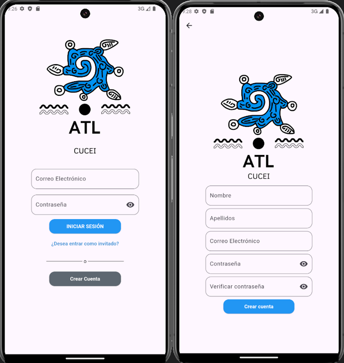
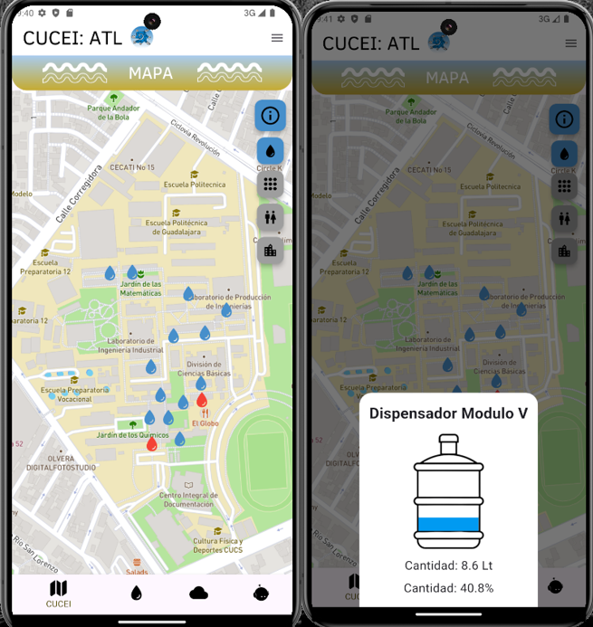
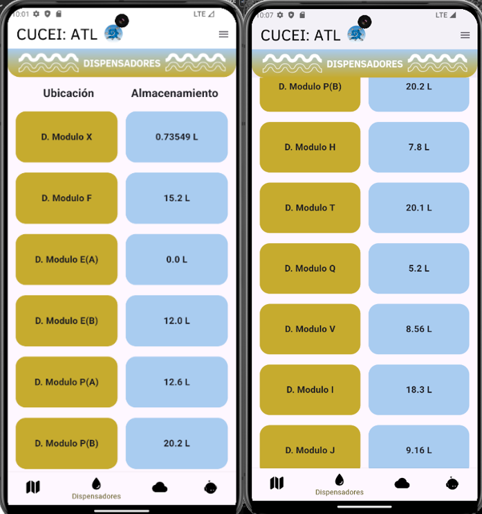
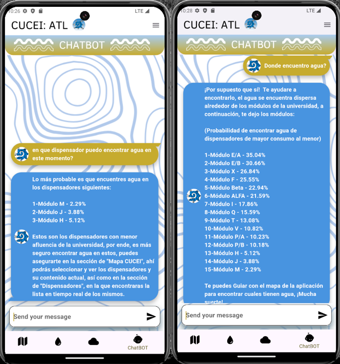
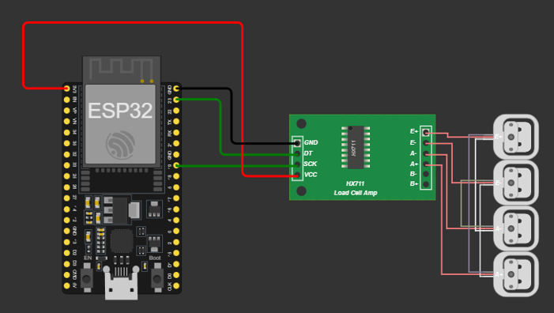
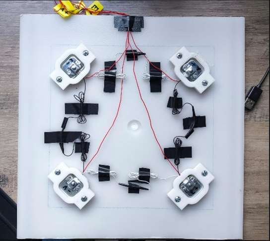

<div align="center">
  
</div>

# ATL CUCEI Aplicacion de localizacion de dispensadores en tiempo real con Dart
Aplicación desarrollada para proyecto modular, para la localización en tiempo real de los diferentes dispensadores localizados en el centro universitario CUCEI, mediante DART/Flutter y Arduino mediante sensores de peso y conexiones con Firebase.

# EXPLICACION-DEL-PROYECTO
# ATL (Agua en Náhuatl)

ATL es una aplicación móvil diseñada para proporcionar información en tiempo real sobre la disponibilidad de agua en puntos de distribución en el Centro Universitario de Ciencias Exactas e Ingenierías (CUCEI). Este proyecto integra sensores de peso conectados mediante ESP-32 y Arduino, Firebase como base de datos, y un chatbot inteligente impulsado por Dialogflow. El objetivo principal es optimizar el acceso al agua, mejorar la logística de distribución y fomentar el cuidado del recurso.

## Características Principales

### Módulo 1: Registro y Seguimiento de Usuarios
- **Inicio de Sesión y Registro:** Los usuarios pueden crear cuentas y acceder a la aplicación mediante Firebase Authentication.
- **Modo Invitado:** Acceso limitado para usuarios que no desean registrarse.
- **Personalización:** Datos de usuario almacenados en Firestore.

  
<div align="center">
  
</div>


### Módulo 2: Gestión de las Tecnologías de la Información
- **Modelo SCRUM:** Utilizado para la gestión ágil del proyecto.
- **Arquitectura en Capas:**
  - **Presentación:** Flutter para la interfaz de usuario.
  - **Lógica de Negocio:** Implementada en Dart.
  - **Persistencia:** Firebase Realtime Database y Firestore.
- **Normas y Estándares:**
  - **ISO/IEC 27001:** Seguridad de la información.
  - **IEEE 829:** Documentación de pruebas.
- **Optimización de Datos:** Uso de algoritmos de compresión para minimizar el consumo de ancho de banda.

  
<div align="center">
  
</div>


### Módulo 3: Sistemas Robustos, Paralelos y Distribuidos
- **Arquitectura Cliente-Servidor:** Firebase actúa como servidor para la sincronización de datos en tiempo real.
- **Sensores Descentralizados:** Cada dispensador tiene un ESP-32 que envía datos directamente a Firebase, reduciendo puntos únicos de fallo.
- **Protocolos de Comunicación:**
  - **HTTP/REST:** Actualmente en uso.
  - **MQTT:** Considerado para futuras mejoras en eficiencia energética.


<div align="center">
  
</div>


### Módulo 4: Cómputo Flexible
- **Conexión con Sensores:** Los datos de sensores de peso se actualizan en tiempo real en Firebase.
- **Chatbot Inteligente:**
  - Basado en Dialogflow, ayuda a resolver dudas sobre la aplicación.
  - Notifica y recomienda hidratación en días calurosos.
- **Análisis de Uso:**
  - Estadísticas semanales sobre consumo y recargas.
  - Identificación de puntos de mayor demanda para optimizar la logística.

<div align="center">
  
</div>


## Tecnologías Utilizadas
- **Frontend:** Flutter y Dart.
- **Backend:** Firebase (Realtime Database y Firestore).
- **Hardware:** ESP-32, sensores de peso de 50 kg, y amplificador HX711.
- **Inteligencia Artificial:** Dialogflow para procesamiento de lenguaje natural.
- **Control de Versiones:** Git.

# Explicación del Circuito Utilizado en el Proyecto ATL

En el proyecto **ATL (Agua en Náhuatl)**, se diseñó un circuito basado en el microcontrolador **ESP32-WROOM-32** para registrar la cantidad de agua disponible en los dispensadores mediante sensores de peso. A continuación, se detalla el diseño del circuito y las conexiones:

---

## **Componentes del Circuito**

<div align="center">
  
</div>

1. **Microcontrolador**:
   - **ESP32-WROOM-32**: Utilizado por su conectividad Wi-Fi integrada, bajo consumo de energía y capacidad de procesamiento, lo que permite la transmisión en tiempo real de datos a Firebase.

2. **Sensores de Peso**:
   - **Celdas de Carga (4 unidades)**: Cada celda soporta hasta 50 kg y se utiliza para medir el peso del agua en los dispensadores.
   - **HX711**: Amplificador y convertidor ADC (Analógico-Digital) que traduce las señales analógicas de las celdas de carga a un formato digital que puede ser procesado por el ESP32.

3. **Fuentes de Alimentación**:
   - **Batería o Fuente de 5V**: Para alimentar el ESP32 y el módulo HX711.
   - **Reguladores de Voltaje** (si es necesario): Para garantizar un suministro estable a los componentes sensibles.

4. **Conexiones Eléctricas**:
   - **Cables Dupont y Conectores**: Usados para conectar los componentes de manera estable.
   - **Placa de Pruebas** (opcional): Para montar los componentes durante el prototipado.
---

## **Diseño del Circuito**

### **Conexión de las Celdas de Carga**
- Cada celda de carga tiene **cuatro cables**:
  - **Rojo (+E)**: Voltaje positivo.
  - **Negro (-E)**: Voltaje negativo.
  - **Blanco (+S)**: Señal positiva.
  - **Verde (-S)**: Señal negativa.
- Se conectan en una configuración **puente Wheatstone**, donde dos celdas forman una rama del puente y las otras dos forman la otra rama. Esto permite una medición precisa de la fuerza ejercida (peso).

### **Conexión del HX711**
- El módulo HX711 tiene pines de entrada para las celdas de carga y pines de salida para el microcontrolador.
- **Pines del HX711**:
  - **E+ y E-**: Alimentan las celdas de carga.
  - **A+ y A-**: Reciben las señales analógicas de las celdas de carga.
  - **GND**: Conexión a tierra.
  - **VCC**: Alimentación de 3.3V o 5V.
  - **DT** y **SCK**: Pines de datos y reloj, conectados al ESP32.

### **Conexión al ESP32**
- **Pines digitales del ESP32**:
  - **DT (Data)** del HX711 → GPIO del ESP32 (por ejemplo, GPIO 21).
  - **SCK (Clock)** del HX711 → GPIO del ESP32 (por ejemplo, GPIO 22).
- **Alimentación**:
  - El ESP32 y el HX711 se alimentan desde la misma fuente de 5V para garantizar un funcionamiento estable.

### **Conexión Wi-Fi**
El ESP32 utiliza su módulo Wi-Fi integrado para enviar los datos al servidor Firebase en tiempo real. Esto elimina la necesidad de una conexión física entre los dispensadores y el sistema principal.

<div align="center">
  
</div>

---

## **Esquema Eléctrico Simplificado**

```plaintext
Celdas de carga (x4)
   |-------|
   | HX711 |-------> ESP32
   |-------|
         |
    Fuente de Alimentación (5V)
```


# **Objetivo del Proyecto**
El objetivo principal de ATL es proporcionar una solución innovadora para monitorear y gestionar la disponibilidad de agua apta para consumir en el CUCEI. Este proyecto busca:

- **Facilitar el acceso a información en tiempo real** sobre la cantidad de agua en los dispensadores del campus.
- **Optimizar la logística de distribución** mediante análisis de datos y estadísticas.
- **Promover el cuidado del agua** y fomentar una cultura de sostenibilidad entre los usuarios.

---

## **Motivación**
El agua es un recurso esencial y limitado. En espacios de alto flujo, como instituciones académicas, es común encontrar dispensadores agotados o con mala gestión. Este proyecto nace de la necesidad de:

1. Evitar interrupciones en el acceso al agua potable.
2. Mejorar la experiencia del usuario.
3. Implementar tecnología moderna que permita un manejo eficiente del recurso.

---

## **Justificación**
- **Tecnología y Sostenibilidad:** Integrar sensores inteligentes con bases de datos en tiempo real y análisis de inteligencia artificial permite desarrollar un sistema robusto y eficiente para la gestión del agua.
- **Impacto Social:** Garantizar el acceso constante al agua mejora la calidad de vida en el entorno educativo.
- **Optimización de Recursos:** El análisis estadístico permite identificar patrones de uso y planificar recargas de manera más eficiente, reduciendo costos y desperdicio.

---

## **Solución Propuesta**
ATL combina tecnologías de hardware, software y análisis de datos para ofrecer una solución integral. Las principales funciones incluyen:

1. **Monitoreo en Tiempo Real:** Sensores de peso conectados a un ESP-32 envían datos a Firebase para actualizar en tiempo real la cantidad de agua disponible.
2. **Interfaz Intuitiva:** Una aplicación móvil en Flutter muestra información clara y actualizada sobre los dispensadores.
3. **Asistencia Inteligente:** Un chatbot basado en Dialogflow resuelve dudas, recomienda hidratación y fomenta el cuidado del recurso.
4. **Análisis Estadístico:** Generación de reportes semanales que identifican puntos de mayor afluencia y optimizan la distribución.

---

## **Impacto**
- **Usuarios:** Mejor experiencia al garantizar acceso continuo al agua.
- **Administradores:** Datos precisos para planificar recargas y mantenimiento.
- **Medio Ambiente:** Promoción del consumo responsable y reducción del desperdicio.

---


## Instalación

1. Clonar el repositorio:
   ```bash
   git clone https://github.com/NOATAGAA/ATL-CUCEI-Aplicacion-de-localizacion-de-dispensadores-en-tiempo-real-con-Dart.git
   ```
2. Instalar las dependencias de Flutter:
   ```bash
   flutter pub get
   ```
3. Configurar Firebase:
   - Agrega el archivo `google-services.json` (Android) o `GoogleService-Info.plist` (iOS) en sus respectivas carpetas.
   - Carga el archivo `service.json` de Dialogflow en la carpeta `assets`.
4. Ejecutar la aplicación:
   ```bash
   flutter run
   ```

## Contribución
¡Las contribuciones son bienvenidas! Por favor, abre un issue o envía un pull request para proponer cambios o mejoras.

## Licencia
Este proyecto está bajo la Licencia MIT. Consulta el archivo LICENSE para más detalles.

---

**Autor:** [NOATAGAA]  
**Contacto:** [fernandotrujilloc28@gmail.com]  
**Repositorio Oficial:** [[ATL-CUCEI](https://github.com/NOATAGAA/ATL-CUCEI-Aplicacion-de-localizacion-de-dispensadores-en-tiempo-real-con-Dart)]
